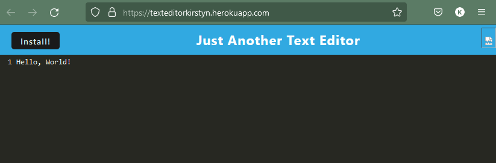
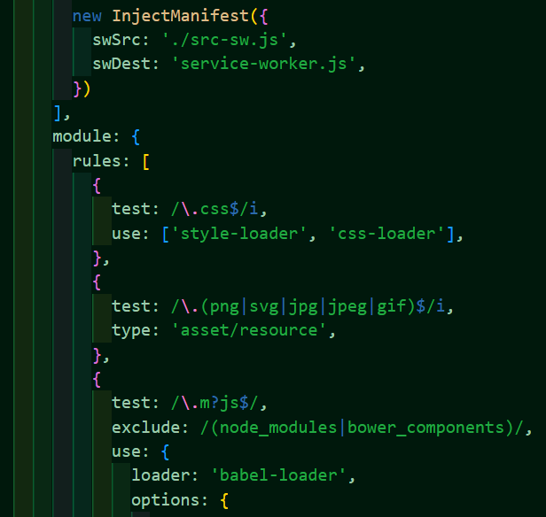

# Text Editor

The Text Editor was created to allow users to add, edit, and delete text to a website, even if they have no access to the internet.

## Description

The Text Editor aides users in creating, updating, maintaining, and deleting text they typed into a webpage. Users are able to access the information, even if they are offline. This PWA runs in the browser and utilizes a variety of data persistence techniques to ensure users do not lose their writing progress if the internet goes out.

## Technologies Used

- HTML
- CSS
- JavaScript
- webpack
- HTMLWebpackPlugin
- IndexedDB
- idb
- Workbox

## Usage and Website

[The Text Editor](https://texteditorkirstyn.herokuapp.com/) allows users to write text, even if they are offline. Users can also download the application to use offline by clicking the 'install' button on the top left corner. It can be found deployed [here](https://texteditorkirstyn.herokuapp.com/).

Below is the Text Editor Website deployed on Heroku.

Below is a little bit of code for utilizing the InjectManifest found within the webpack.config.js file.

## Credits

Starter code made by [Xander Rapstine](https://github.com/Xandromus) 

Built on by [Kirstyn Gonzalez](https://github.com/kirstgonz)

## License

[https://choosealicense.com/](https://choosealicense.com/).
